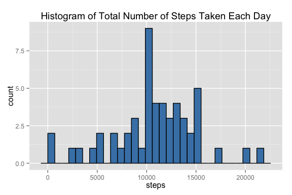
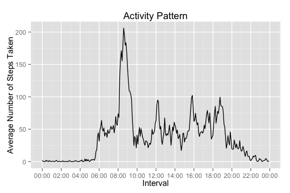
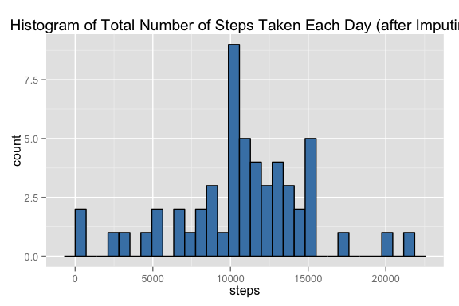
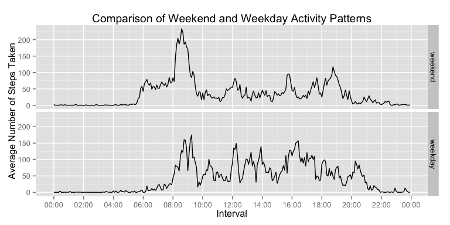

# Reproducible Research: Peer Assessment 1

```r
options(scipen = 1, digits = 2)
library(dplyr)
```

```
## 
## Attaching package: 'dplyr'
## 
## The following object is masked from 'package:stats':
## 
##     filter
## 
## The following objects are masked from 'package:base':
## 
##     intersect, setdiff, setequal, union
```

```r
library(ggplot2)
library(scales)
```

## Loading and preprocessing the data
Show any code that is needed to

Load the data (i.e. read.csv())

Process/transform the data (if necessary) into a format suitable for your analysis

```r
unzip("activity.zip")
activity.data <- read.csv(
    "activity.csv", 
    na.strings="NA",
    col.names = c("steps", "date", "interval"),
    colClasses = c("numeric", "Date", "character")
)
```
I formatted the interval so that it is of fixed width.

```r
activity.data <- mutate(
    activity.data, 
    interval= sprintf("%04s",interval)
)
```

## What is mean total number of steps taken per day?
Calculate the total number of steps taken per day

```r
steps_per_day <- aggregate(steps ~ date, data = activity.data, sum)
```
A histogram of the total number of steps taken each day is as follows:

```r
qplot(steps, data = steps_per_day, 
      main="Histogram of Total Number of Steps Taken Each Day") +
    geom_histogram(colour="black", fill="steelblue") 
```

 

The mean of the total number of steps taken per day is 10766.19.  
The median of the total number of steps taken per day is 10765.

## What is the average daily activity pattern?

```r
steps_per_interval <- activity.data %>% 
    group_by(interval) %>%
    summarize(steps = mean(steps, na.rm=TRUE))
    
##OR:
pattern.data <- aggregate(steps ~ interval, 
                                  data = activity.data, 
                                  mean)
pattern.data$interval = strptime(pattern.data$interval, format="%H%M")
```

Make a time series plot (i.e. type = "l") of the 5-minute interval (x-axis) and the average number of steps taken, averaged across all days (y-axis)


```r
g <- ggplot(pattern.data, aes(x = as.POSIXct(interval), y = steps)) + 
    scale_x_datetime(breaks= date_breaks("2 hours"), labels = date_format("%H:%M")) +
    xlab("Interval") +
  ylab("Average Number of Steps Taken") +
  ggtitle("Activity Pattern")
g + geom_line(aes(group=1))
```

 

Which 5-minute interval, on average across all the days in the dataset, contains the maximum number of steps?

```r
filter(steps_per_interval, steps == max(steps_per_interval$steps))
```

```
## Source: local data frame [1 x 2]
## 
##   interval steps
## 1     0835   206
```


## Imputing missing values
Calculate and report the total number of missing values in the dataset.

```r
table(is.na(activity.data))
```

```
## 
## FALSE  TRUE 
## 50400  2304
```

```r
num_missing_values <- table(is.na(activity.data))[["TRUE"]]
```
There are 2304 missing.

In order to decide how best to fill in the missing values, I look at where the missing values actually are:

```r
activity.data <- mutate(activity.data, isna= is.na(steps))
nas <- activity.data %>% group_by(date) %>% summarize(allna = all(isna), anyna = any(isna))
nas %>% filter(anyna==TRUE)
```

```
## Source: local data frame [8 x 3]
## 
##         date allna anyna
## 1 2012-10-01  TRUE  TRUE
## 2 2012-10-08  TRUE  TRUE
## 3 2012-11-01  TRUE  TRUE
## 4 2012-11-04  TRUE  TRUE
## 5 2012-11-09  TRUE  TRUE
## 6 2012-11-10  TRUE  TRUE
## 7 2012-11-14  TRUE  TRUE
## 8 2012-11-30  TRUE  TRUE
```
The missing values occur on eight days, and on every interval in those eight days.
So I think it makes the most sense to use the daily average of the interval.
I'll use the mean.

Create a new dataset that is equal to the original dataset but with the missing data filled in.

```r
steps_for_interval = function(t){
    steps_per_interval[steps_per_interval$"interval"==t,"steps"]
}
steps2 <- steps_for_interval(activity.data$interval)
activity.data <- data.frame(activity.data, steps2 = steps2$steps)

imputed.data <- activity.data %>% 
                    mutate(steps = ifelse(isna==FALSE, 
                                        steps, 
                                        steps2
                                        )) %>% 
                    select(steps, date, interval, isna)
```


```r
steps_per_day <- aggregate(steps ~ date, data = imputed.data, sum)
```
Make a histogram of the total number of steps taken each day.

```r
qplot(steps, data = steps_per_day,
      main="Histogram of Total Number of Steps Taken Each Day (after Imputing)") +
    geom_histogram(colour="black", fill="steelblue") 
```

 

After filling in these missing values, the mean of the total number of steps taken per day is 10766.19.  
The median of the total number of steps taken per day is 10765.59.
Adding in the missing values has very little impact on our estimates.

## Are there differences in activity patterns between weekdays and weekends?
Create a new factor variable in the dataset with two levels – “weekday” and “weekend” indicating whether a given date is a weekday or weekend day.

```r
imputed.data <- imputed.data %>% 
    mutate(daytype = ifelse(
                            weekdays(date) %in% c("Saturday", "Sunday"), 
                            "weekend",
                            "weekday")
           ) 
imputed.data$daytype <- factor(imputed.data$daytype, labels= c("weekend","weekday"))

pattern.data2 <- aggregate(steps ~ daytype + interval, 
                                   data = imputed.data, 
                                   mean)

pattern.data2$interval = strptime(pattern.data2$interval, format="%H%M")
```

Make a panel plot containing a time series plot (i.e. type = "l") of the 5-minute interval (x-axis) and the average number of steps taken, averaged across all weekday days or weekend days (y-axis). 

```r
g <- ggplot(pattern.data2, aes(x = as.POSIXct(interval), y = steps)) + 
    scale_x_datetime(breaks= date_breaks("2 hours"), labels = date_format("%H:%M")) +
  xlab("Interval") +
  ylab("Average Number of Steps Taken") +
  ggtitle("Comparison of Weekend and Weekday Activity Patterns")
g + geom_line(aes(group=daytype))+ facet_grid(daytype ~ .)
```

 
